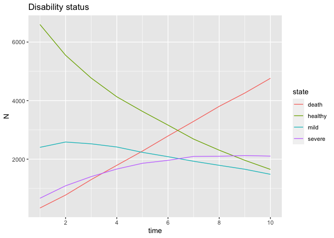

<!-- README.md is generated from README.Rmd. Please edit that file -->

# microsim-disability

## Import data and model

``` r
library(dymiumCore)
#> ── * dymium's options * ────────────────────────────────────────────────────────
#> ● dymium.input_dir:
#>   /var/folders/0d/9srpj_750lxbkfs2_8nwkcpw0000gn/T//RtmpTMrdTm/scenario/inputs
#> ● dymium.output_dir:
#>   /var/folders/0d/9srpj_750lxbkfs2_8nwkcpw0000gn/T//RtmpTMrdTm/scenario/outputs
#> ● dymium.scenario_dir:
#>   /var/folders/0d/9srpj_750lxbkfs2_8nwkcpw0000gn/T//RtmpTMrdTm/scenario
#> ● dymium.simulation_scale: 1
library(data.table)

# generate a population
population <- 
  fread("data/base.csv") %>%
  .[, sex := ifelse(female == 1, "female", "male")] %>%
  .[, c("female") := NULL] %>%
  .[, state := factor(x = state, levels = 1:3, labels = c("healthy", "mild", "severe"))]

# create World
w <- World$new()
a <- Agent$new(.data = population, id_col = "id")

# add Agent to World
w$add(a, name = "Agent")
#> [12:03:16] WARN  dymiumCore w$add: The given `name` will be ignored since the object in x is of a Dymium class object. The classname of the object will be used as its name.

# convert the transition matrix to a format that dymiumCore can understand
# see https://core.dymium.org/articles/dymium-intro.html#transition
trans_model <-
  fread("data/tprob.csv") %>%
  .[, `:=`(probs = .(c(healthy, mild, severe, death)),
           choices = .(c("healthy", "mild", "severe", "death"))), 
    by = 1:nrow(.)] %>%
  setnames(old = "from", new = "state") %>%
  .[, sex := ifelse(female == 1, "female", "male")] %>%
  .[, c("healthy", "mild", "severe", "death", "female") := NULL]
```

## Create microsimulation events

``` r
event_disability <- function(w, model) {
  
  Agt <- w$get("Agent")
  
  # select only agents that are older than 50 years old
  eligible_agent_ids <- Agt$get_data()[age > 50 & state != "death",
                                       get(Agt$get_id_col())]
  
  TransitionDisability <- 
    TransitionClassification$new(
      x = Agt, 
      model = model, 
      targeted_agents = eligible_agent_ids
    )
  
  # use the simulated result to update the 'state' attribute of the selected agents
  TransitionDisability$update_agents(attr = "state")

  Agt$log(desc = "disability:state",
          value = xtabs(~ state, data = Agt$get_data()))
  
  return(w)
}

event_age <- function(w) {
  Agt <- w$get("Agent")
  
  # update age of alive agents, with max of 114.
  Agt$get_data(copy = FALSE) %>%
    .[state != "death", age := ifelse(age + 1L > 114L, 114L, age + 1L)]
  
  return(w)
}
```

## Microsimulation pipeline

``` r
for (i in 1:10) {
  w$start_iter(time_step = i, unit = "year") %>%
    event_age(.) %>%
    event_disability(., trans_model)
}
```

## Visualisation

``` r
library(purrr) # for working with lists
#> 
#> Attaching package: 'purrr'
#> The following object is masked from 'package:data.table':
#> 
#>     transpose
library(ggplot2)

simlog <- get_log(w)

statelog <- 
  purrr::map2_dfr(simlog$time, simlog$value, ~ {
    .y %>% 
      as.data.table() %>%
      .[, time := .x]
  })

ggplot(data = statelog, aes(x = time, y = N, color = state)) +
  geom_line() +
  scale_x_continuous(breaks = scales::pretty_breaks()) +
  labs(title = "Disability status")
```

<!-- -->
