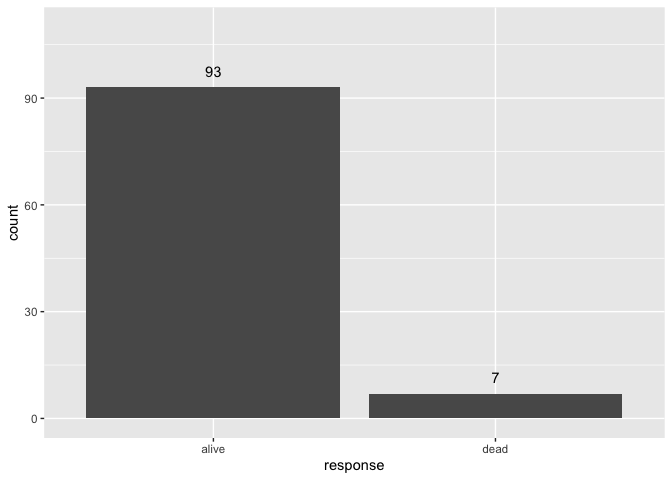

State simulator
================

This is the `monte_carlo_sim` function from dymiumCore package. It is
meant to be used for simulating which of the states in `prediction`, a
data.table object, agents are transitioning into, you may ignore
`target` for now.

``` r
monte_carlo_sim <- function(prediction, target) {
  checkmate::assert_data_frame(
    prediction,
    types = 'double',
    min.cols = 2,
    any.missing = FALSE,
    null.ok = FALSE,
    col.names = 'unique'
  )

  if (!is.data.table(prediction)) {
    setDT(prediction)
  }

  choices <- names(prediction)

  if (!is.null(target)) {
    return(alignment(prediction, target))
  } else {
    # random draw choices
    return(purrr::pmap_chr(prediction, ~ dymiumCore::sample_choice(choices, 1, prob = (list(...)))))
  }
}
```

Assuming that our `prediction` looks like the following:

``` r
my_prediction <-
  data.table(
    alive = rep(0.9, 100),
    dead = rep(0.1, 100)
  )
```

Each row represent the transition probabilities of each agent. This
implies that there are 100 agents.

So to simulate which state they are transitioning into we can use
`monte_carlo_sim`.

``` r
sim_result <- monte_carlo_sim(my_prediction, target = NULL)
```

The function returns a character vector with length of 100 (it should
come as no surprise since we have 100 agents). Each element belongs to
the agent of that corresponding index.

Let’s visualise the result.

``` r
ggplot(data.frame(response = sim_result), aes(response)) +
  geom_bar() +
  geom_text(stat = 'count', aes(label = ..count..), vjust = -1) +
  ylim(0, 110)
```

<!-- -->
